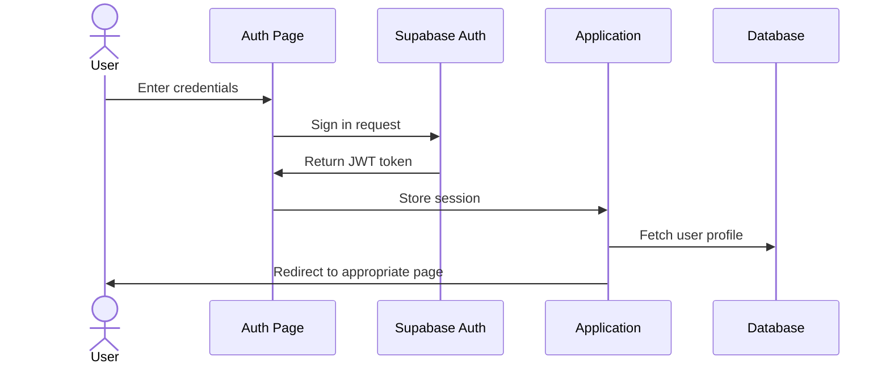

# Authentication

This document outlines the authentication system used in the SoundMaster Radio application.

## Authentication Flow

1. User navigates to the Auth page
2. User enters credentials or uses social login
3. Supabase authenticates and returns a session token
4. Application stores the token and fetches the user profile
5. User is redirected to the appropriate page based on their role



## Authentication Methods

### Email/Password Authentication

```typescript
// Sign up with email and password
const signUp = async (email: string, password: string) => {
  const { data, error } = await supabase.auth.signUp({
    email,
    password,
  });
  return { data, error };
};

// Sign in with email and password
const signIn = async (email: string, password: string) => {
  const { data, error } = await supabase.auth.signInWithPassword({
    email,
    password,
  });
  return { data, error };
};
```

### Social Authentication

```typescript
// Sign in with Google OAuth
const signInWithGoogle = async () => {
  const { data, error } = await supabase.auth.signInWithOAuth({
    provider: 'google',
    options: {
      redirectTo: `${window.location.origin}/auth/callback`,
    },
  });
  return { data, error };
};
```

### Sign Out

```typescript
// Sign out the current user
const signOut = async () => {
  const { error } = await supabase.auth.signOut();
  return { error };
};
```

## Role-Based Access Control

User roles are stored in the `profiles` table:

```sql
create table public.profiles (
  id uuid not null references auth.users on delete cascade,
  username text,
  is_admin boolean default false,
  created_at timestamp with time zone default timezone('utc'::text, now()),
  avatar_url text,
  primary key (id)
);
```

### User Roles

- **Public Users**: Can access public routes and stream content
- **Authenticated Users**: Can access protected routes like Dashboard and Live Lesson
- **Admin Users**: Can access admin routes and manage content

### Implementation Details

Authentication state is managed using the `useAuth` hook:

```typescript
// useAuth hook implementation
export const useAuth = () => {
  const [user, setUser] = useState<User | null>(null);
  const [isAdmin, setIsAdmin] = useState(false);
  
  useEffect(() => {
    // Set up authentication listener
    const { data: { subscription } } = supabase.auth.onAuthStateChange(
      async (event, session) => {
        if (session) {
          setUser(session.user);
          
          // Check if user is admin
          const { data } = await supabase
            .from('profiles')
            .select('is_admin')
            .eq('id', session.user.id)
            .single();
            
          setIsAdmin(data?.is_admin || false);
        } else {
          setUser(null);
          setIsAdmin(false);
        }
      }
    );
    
    return () => {
      subscription.unsubscribe();
    };
  }, []);
  
  return { user, isAdmin };
};
```

## Protected Routes

Protected routes ensure that only authenticated users can access certain pages:

```tsx
// ProtectedRoute component
export const ProtectedRoute = ({ children }: { children: React.ReactNode }) => {
  const { user } = useAuth();
  const navigate = useNavigate();
  
  useEffect(() => {
    if (!user) {
      navigate('/auth', { replace: true });
    }
  }, [user, navigate]);
  
  if (!user) {
    return <LoadingSpinner />;
  }
  
  return <>{children}</>;
};
```

## Admin Routes

Admin routes ensure that only admin users can access administrative pages:

```tsx
// AdminRoute component
export const AdminRoute = ({ children }: { children: React.ReactNode }) => {
  const { user, isAdmin } = useAuth();
  const navigate = useNavigate();
  
  useEffect(() => {
    if (!user) {
      navigate('/auth', { replace: true });
    } else if (!isAdmin) {
      navigate('/dashboard', { replace: true });
    }
  }, [user, isAdmin, navigate]);
  
  if (!user || !isAdmin) {
    return <LoadingSpinner />;
  }
  
  return <>{children}</>;
};
```

## Password Reset Flow

```typescript
// Request password reset
const requestPasswordReset = async (email: string) => {
  const { data, error } = await supabase.auth.resetPasswordForEmail(email, {
    redirectTo: `${window.location.origin}/auth/reset-password`,
  });
  return { data, error };
};

// Update password after reset
const updatePassword = async (newPassword: string) => {
  const { data, error } = await supabase.auth.updateUser({
    password: newPassword,
  });
  return { data, error };
};
```

## Security Considerations

- **JWT Expiration**: Session tokens expire after a configurable period
- **Refresh Tokens**: Used to obtain new tokens without requiring re-authentication
- **HTTPS**: All authentication traffic is encrypted
- **Password Rules**: Minimum strength requirements for passwords
- **Rate Limiting**: Limits on authentication attempts to prevent brute force attacks

